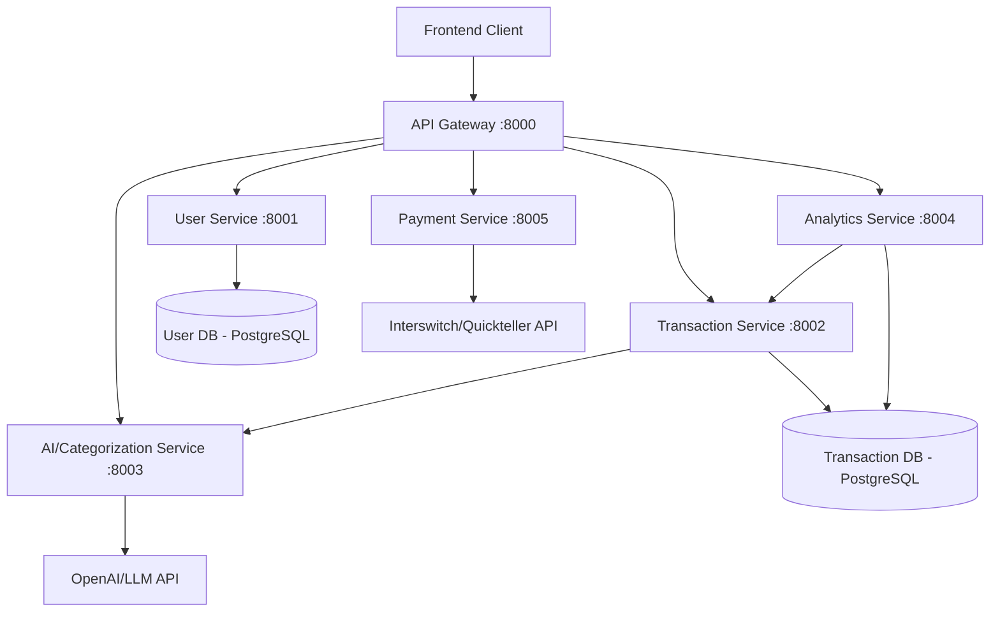

# LedgerMind - Implementation Plan

> AI-powered accounting assistant for SMEs & freelancers  
> **Hackathon**: Interswitch Developer Community  
> **Stack**: Django REST Framework + Microservices + TDD  
> **Duration**: 5 days (March 23-27, 2026)

---

## Architecture Overview



## Microservices Breakdown

### Service 1: API Gateway (Port 8000)
- Routes requests to appropriate microservices
- JWT token validation/forwarding
- Rate limiting & CORS
- Health check aggregation
- Request logging

### Service 2: User Service (Port 8001)
- User registration (email + password)
- JWT authentication (login/logout/refresh)
- Business profile CRUD
- User profile management

### Service 3: Transaction Service (Port 8002)
- Transaction CRUD (income/expense)
- CSV upload & parsing
- Transaction categorization (calls AI Service)
- Category management
- Filtering, pagination, search

### Service 4: AI/Categorization Service (Port 8003)
- AI-powered transaction categorization
- Rule-based fallback categorization
- Category suggestions
- Pattern recognition

### Service 5: Analytics Service (Port 8004)
- Dashboard data aggregation
- Cashflow forecasting (3-month prediction)
- Credit readiness score calculation
- Income vs Expense trends
- Category-wise spending breakdown

### Service 6: Payment Service (Port 8005)
- Interswitch/Quickteller payment integration
- Payment initiation & verification
- Payment history
- Webhook handling

---

## Database Schema

### User Service DB
```
users
├── id (UUID, PK)
├── email (unique)
├── password (hashed)
├── first_name
├── last_name
├── phone_number
├── created_at
└── updated_at

businesses
├── id (UUID, PK)
├── owner_id (FK → users.id)
├── name
├── industry
├── description
├── address
├── created_at
└── updated_at
```

### Transaction Service DB
```
categories
├── id (UUID, PK)
├── name
├── type (income/expense)
├── description
├── is_default (bool)
├── created_at
└── updated_at

transactions
├── id (UUID, PK)
├── business_id (UUID - reference to User Service)
├── category_id (FK → categories.id)
├── type (income/expense)  
├── amount (Decimal)
├── description
├── date
├── ai_categorized (bool)
├── source (manual/csv/api)
├── created_at
└── updated_at
```

### Payment Service DB
```
payments
├── id (UUID, PK)
├── business_id (UUID)
├── amount (Decimal)
├── currency (NGN)
├── status (pending/success/failed)
├── reference (unique)
├── transaction_ref
├── payment_id (Interswitch)
├── description
├── created_at
└── updated_at
```

---

## Interswitch Integration Details

### Authentication (OAuth 2.0)
- Base64 encode `client_id:secret_key`
- POST to token endpoint with `grant_type=client_credentials`
- Use Bearer token in subsequent requests

### Payment Flow
1. Generate access token
2. POST purchase request to `/api/v3/purchases`
3. Handle OTP response (responseCode: T0 for Verve/Mastercard)
4. Authenticate OTP
5. Confirm transaction status

### Environments
- **Sandbox**: `https://qa.interswitchng.com`
- **Production**: `https://saturn.interswitchng.com`

---

## Project Structure

```
ledgermind/
├── docker-compose.yml
├── shared/                    # Shared utilities
│   ├── authentication.py      # JWT validation helpers
│   ├── permissions.py         # DRF permissions
│   ├── pagination.py          # Standard pagination
│   ├── exceptions.py          # Custom exceptions
│   └── utils.py               # Common utilities
├── api_gateway/               # Port 8000
│   ├── manage.py
│   ├── gateway/
│   │   ├── settings.py
│   │   ├── urls.py
│   │   └── wsgi.py
│   ├── proxy/
│   │   ├── views.py
│   │   ├── urls.py
│   │   └── middleware.py
│   └── requirements.txt
├── user_service/              # Port 8001
│   ├── manage.py
│   ├── config/
│   │   ├── settings.py
│   │   ├── urls.py
│   │   └── wsgi.py
│   ├── users/
│   │   ├── models.py
│   │   ├── serializers.py
│   │   ├── views.py
│   │   ├── urls.py
│   │   └── tests/
│   ├── businesses/
│   │   ├── models.py
│   │   ├── serializers.py
│   │   ├── views.py
│   │   ├── urls.py
│   │   └── tests/
│   └── requirements.txt
├── transaction_service/       # Port 8002
│   ├── manage.py
│   ├── config/
│   ├── transactions/
│   │   ├── models.py
│   │   ├── serializers.py
│   │   ├── views.py
│   │   ├── urls.py
│   │   ├── services.py
│   │   └── tests/
│   ├── categories/
│   │   ├── models.py
│   │   ├── serializers.py
│   │   ├── views.py
│   │   ├── urls.py
│   │   └── tests/
│   └── requirements.txt
├── ai_service/                # Port 8003
│   ├── manage.py
│   ├── config/
│   ├── categorization/
│   │   ├── views.py
│   │   ├── urls.py
│   │   ├── services.py
│   │   ├── rules.py
│   │   └── tests/
│   └── requirements.txt
├── analytics_service/         # Port 8004
│   ├── manage.py
│   ├── config/
│   ├── dashboard/
│   │   ├── views.py
│   │   ├── urls.py
│   │   ├── services.py
│   │   └── tests/
│   ├── forecasting/
│   │   ├── views.py
│   │   ├── urls.py
│   │   ├── services.py
│   │   └── tests/
│   ├── credit_score/
│   │   ├── views.py
│   │   ├── urls.py
│   │   ├── services.py
│   │   └── tests/
│   └── requirements.txt
└── payment_service/           # Port 8005
    ├── manage.py
    ├── config/
    ├── payments/
    │   ├── models.py
    │   ├── serializers.py
    │   ├── views.py
    │   ├── urls.py
    │   ├── services.py       # Interswitch API client
    │   └── tests/
    └── requirements.txt
```

---

## TDD Approach

For each feature, we follow **Red → Green → Refactor**:

1. **Write failing test** (Red) - Define expected behavior
2. **Write minimal code** (Green) - Make the test pass
3. **Refactor** - Clean up while keeping tests green

### Test Categories per Service:
- **Unit Tests**: Models, serializers, utility functions
- **Integration Tests**: API endpoints, database queries
- **Service Tests**: Inter-service communication mocking

---

## Implementation Order (5-Day Plan)

### Day 1 (Today - March 24): Foundation & User Service ✅
- [x] Create implementation plan
- [ ] Set up project structure with all services
- [ ] Configure Docker & docker-compose
- [ ] Build shared utilities (JWT, permissions, pagination)
- [ ] **User Service**: TDD for registration, login, JWT, business profiles
- [ ] Seed default categories

### Day 2 (March 25): Transaction Service & Categories
- [ ] **Transaction Service**: TDD for CRUD operations  
- [ ] CSV upload & parsing
- [ ] Category management endpoints
- [ ] Inter-service auth setup (service-to-service tokens)

### Day 3 (March 26): AI Service & Analytics
- [ ] **AI Service**: TDD for categorization engine
- [ ] Rule-based categorization
- [ ] OpenAI/LLM integration
- [ ] **Analytics Service**: Dashboard aggregation endpoints
- [ ] Cashflow forecasting algorithm

### Day 4 (March 27): Payment Service & Credit Score
- [ ] **Payment Service**: TDD for Interswitch integration
- [ ] Payment initiation & OTP handling
- [ ] Webhook handler
- [ ] Credit readiness score algorithm
- [ ] API Gateway routing finalization

### Day 5 (March 28): Integration, Polish & Demo
- [ ] Full end-to-end flow testing
- [ ] API Gateway final routing
- [ ] Error handling improvements
- [ ] API documentation (Swagger/ReDoc)
- [ ] Demo preparation & bug fixes

---

## Key Technical Decisions

| Decision | Choice | Rationale |
|----------|--------|-----------|
| Auth | JWT (djangorestframework-simplejwt) | Stateless, microservice-friendly |
| DB | SQLite (dev) / PostgreSQL (prod) | SQLite for speed during hackathon |
| Inter-service Comm | HTTP (requests library) | Simple, synchronous, debuggable |
| AI | OpenAI API + Rule-based fallback | Best accuracy with fallback |
| Payment | Interswitch Quickteller API | Hackathon sponsor requirement |
| Testing | pytest + pytest-django | Better than unittest, fixtures |
| API Docs | drf-spectacular (OpenAPI 3) | Auto-generated Swagger UI |

---

## API Endpoints Summary

### User Service (`/api/v1/users/`)
| Method | Endpoint | Description |
|--------|----------|-------------|
| POST | `/register/` | Register new user |
| POST | `/login/` | Login (returns JWT) |
| POST | `/token/refresh/` | Refresh JWT token |
| GET | `/profile/` | Get user profile |
| PUT | `/profile/` | Update user profile |
| POST | `/businesses/` | Create business |
| GET | `/businesses/` | List user businesses |
| GET/PUT/DEL | `/businesses/{id}/` | Business CRUD |

### Transaction Service (`/api/v1/transactions/`)
| Method | Endpoint | Description |
|--------|----------|-------------|
| POST | `/` | Create transaction |
| GET | `/` | List transactions (filtered) |
| GET/PUT/DEL | `/{id}/` | Transaction CRUD |
| POST | `/upload-csv/` | Upload CSV transactions |
| GET | `/categories/` | List categories |
| POST | `/categories/` | Create custom category |
| GET | `/summary/` | Transaction summary |

### AI Service (`/api/v1/categorize/`)
| Method | Endpoint | Description |
|--------|----------|-------------|
| POST | `/` | Categorize a transaction |
| POST | `/batch/` | Batch categorization |

### Analytics Service (`/api/v1/analytics/`)
| Method | Endpoint | Description |
|--------|----------|-------------|
| GET | `/dashboard/{business_id}/` | Dashboard data |
| GET | `/cashflow-forecast/{business_id}/` | 3-month forecast |
| GET | `/credit-score/{business_id}/` | Credit readiness score |
| GET | `/trends/{business_id}/` | Income/expense trends |

### Payment Service (`/api/v1/payments/`)
| Method | Endpoint | Description |
|--------|----------|-------------|
| POST | `/initiate/` | Initiate payment |
| POST | `/verify/` | Verify payment |
| GET | `/history/` | Payment history |
| POST | `/webhook/` | Interswitch webhook |
